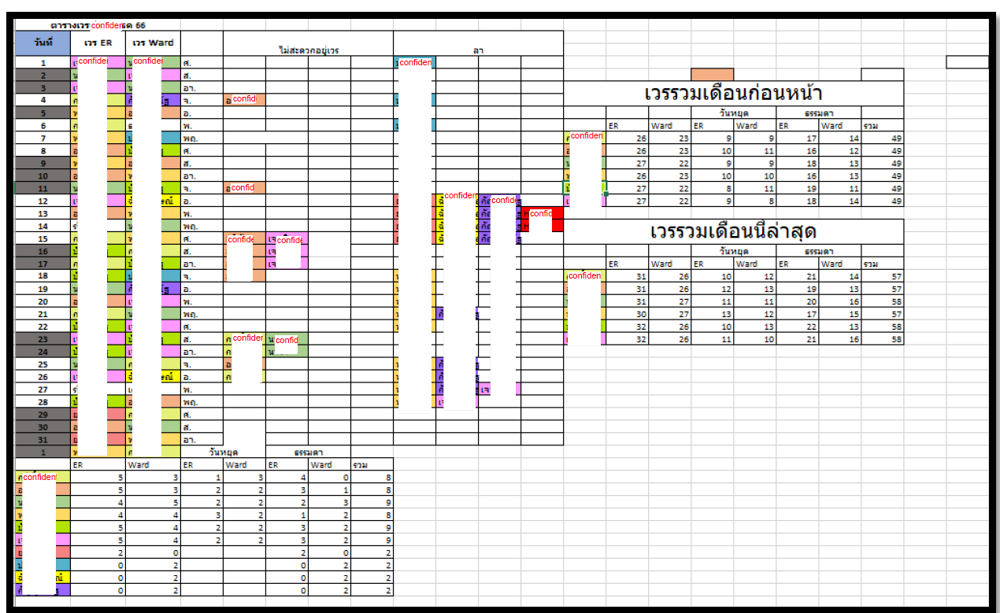
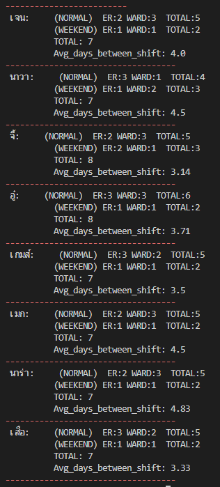

# Thayang hospital Doctor Scheduler

* This python script provides a monthly optimal shift assignment for doctors in the hospital.

* Near the end of each month, doctors submit their availability for the upcoming month, The script then generates an optimal monthly schedules, considering both doctor preferences and hospital 
requirements.

* Prior to implementation, it took 2-3 days for hospital staff to finalize a schedule that contained no major conflict. My program solves this scheduling problem within SECONDS and WITHOUT any conflict.

* See [pdf](requirement.pdf) file for hospital requirement

## How it works?

Hospital requirements and doctor availability are translated into mathematics equations (constraints), then solved using a constraint programming solver [ORTOOLS](https://developers.google.com/optimization).  This project is inspired by [google Nurse Scheduling example](https://developers.google.com/optimization/scheduling/employee_scheduling).

>   Here is an example of a constraint saying that doctors are not allow to work both shift on a single day

 

>  Another example, a constraint saything that each doctor should have approximately the same monthly workload

 

Most requirement can be turn into contraints like the above examples except the constraint that are not linear. The hard part of this project is thinking about how each hospital requirement can be turn into linear equation.

## Example output

>  Optimal Schedule

 

> Summary 

 

## Usage
Requirement (Python 3.10, ORTOOLS)

Excel integration is not included in this repo, you can still run this project manually by editing the first few line in or_all.py to change doctors name, absent list, and etc.

> python or_all.py
